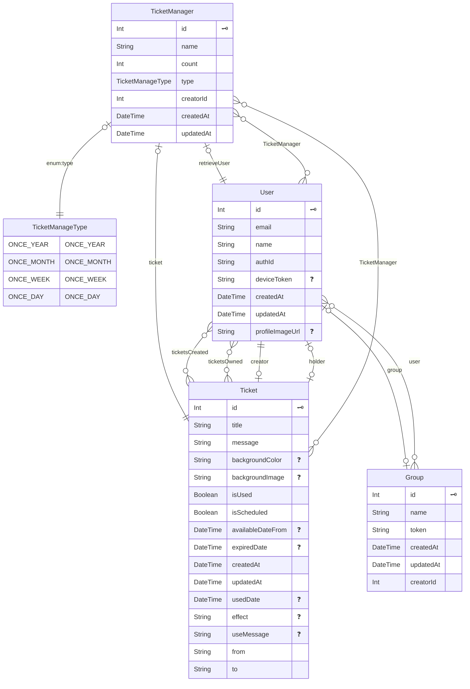

```mermaid
erDiagram

        TicketManageType {
            ONCE_YEAR ONCE_YEAR
ONCE_MONTH ONCE_MONTH
ONCE_WEEK ONCE_WEEK
ONCE_DAY ONCE_DAY
        }
    
  "TicketManager" {
    Int id "🗝️"
    String name 
    Int count 
    TicketManageType type 
    Int creatorId 
    DateTime createdAt 
    DateTime updatedAt 
    }
  

  "Ticket" {
    Int id "🗝️"
    String title 
    String message 
    String backgroundColor "❓"
    String backgroundImage "❓"
    Boolean isUsed 
    Boolean isScheduled 
    DateTime availableDateFrom "❓"
    DateTime expiredDate "❓"
    DateTime createdAt 
    DateTime updatedAt 
    DateTime usedDate "❓"
    String effect "❓"
    String useMessage "❓"
    String from 
    String to 
    }
  

  "Group" {
    Int id "🗝️"
    String name 
    String token 
    DateTime createdAt 
    DateTime updatedAt 
    Int creatorId 
    }
  

  "User" {
    Int id "🗝️"
    String email 
    String name 
    String authId 
    String deviceToken "❓"
    DateTime createdAt 
    DateTime updatedAt 
    String profileImageUrl "❓"
    }
  
    "TicketManager" o|--|| "TicketManageType" : "enum:type"
    "TicketManager" o|--|| "User" : "retrieveUser"
    "TicketManager" o|--|| "Ticket" : "ticket"
    "Ticket" o|--|| "User" : "creator"
    "Ticket" o|--|o "User" : "holder"
    "Ticket" o{--}o "TicketManager" : "TicketManager"
    "Group" o{--}o "User" : "user"
    "User" o{--}o "Ticket" : "ticketsCreated"
    "User" o{--}o "Ticket" : "ticketsOwned"
    "User" o|--|o "Group" : "group"
    "User" o{--}o "TicketManager" : "TicketManager"
```
